
<h1 align="center">基于JavaWeb的个人健康信息管理系统+jsp</h1>

## 简介
个人健康信息管理系统：角色分为管理员、用户；功能包括个人信息管理、健康数据记录及分析、新闻信息管理、公告管理和用户权限管理。整体设计简洁、易用，适合毕业设计项目。    --计算机毕业设计源码；毕设源码；java毕业设计源码

## 联系方式

<h3 align="center">获取完整代码与数据库文件 + 微信：deepguan QQ: 86050149 QQ群: 783742310</h3>

<h3 align="center">可帮忙远程部署 包运行成功！提供远程部署、修改代码、设计文档指导、代码讲解等服务！</h3>

## 功能介绍（完整见运行截图）
管理员： 管理员可以通过导航菜单访问和管理系统的各个模块，这些模块包括个人中心、基础数据管理、公告管理、健康信息管理、新闻信息管理和用户管理等。管理员能够添加、修改或删除用户的信息，管理新闻和公告，操作健康信息的数据并生成分析图表。系统还提供了消息反馈和搜索功能以帮助管理员更有效率地处理数据。

用户： 用户可以登录系统查看和更新个人健康数据，包括输入身高、体重、健康状况、体温、饮食习惯及异常症状等信息。系统同时支持用户管理个人信息，如修改密码和更新个人资料。用户还可以利用导航菜单快速访问不同的管理模块，上传相关健康文件，并通过体温统计功能查看历史数据趋势。整体界面简洁，易于用户进行健康信息的录入和查看。

## 运行截图
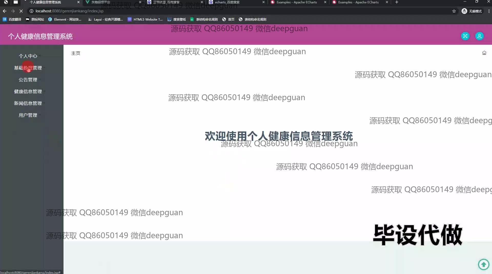
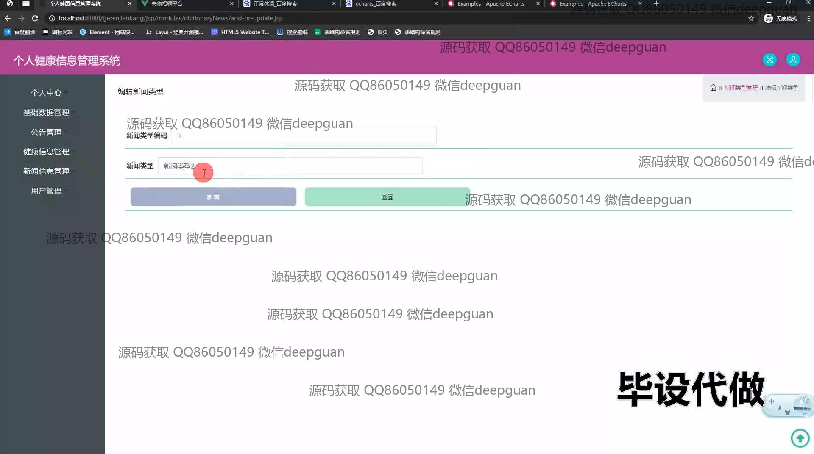
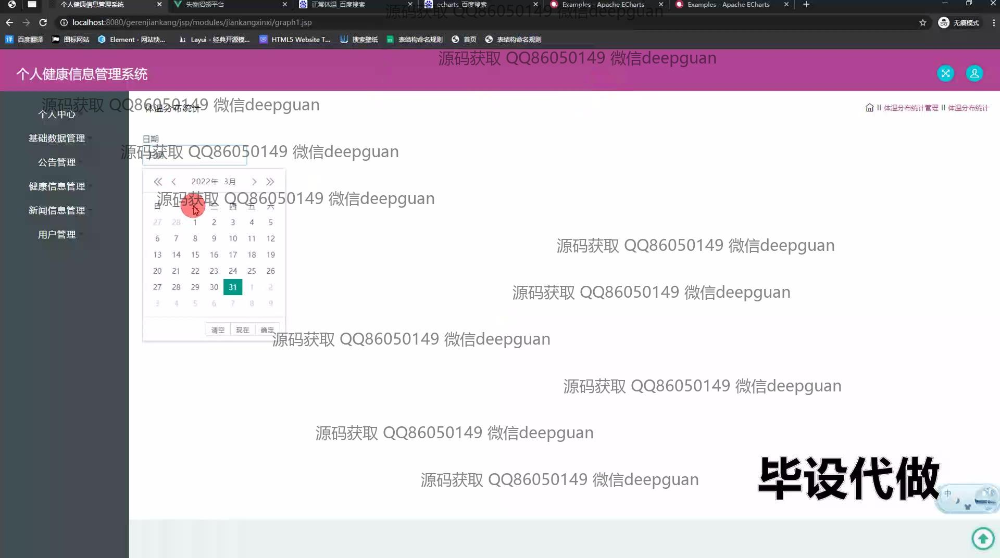
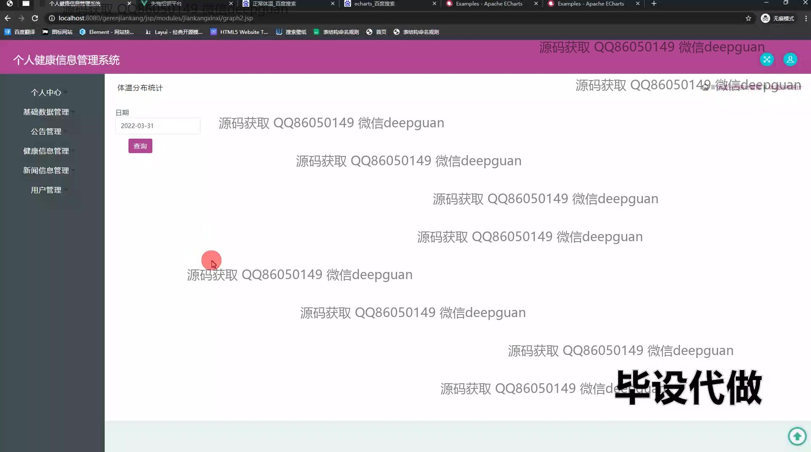
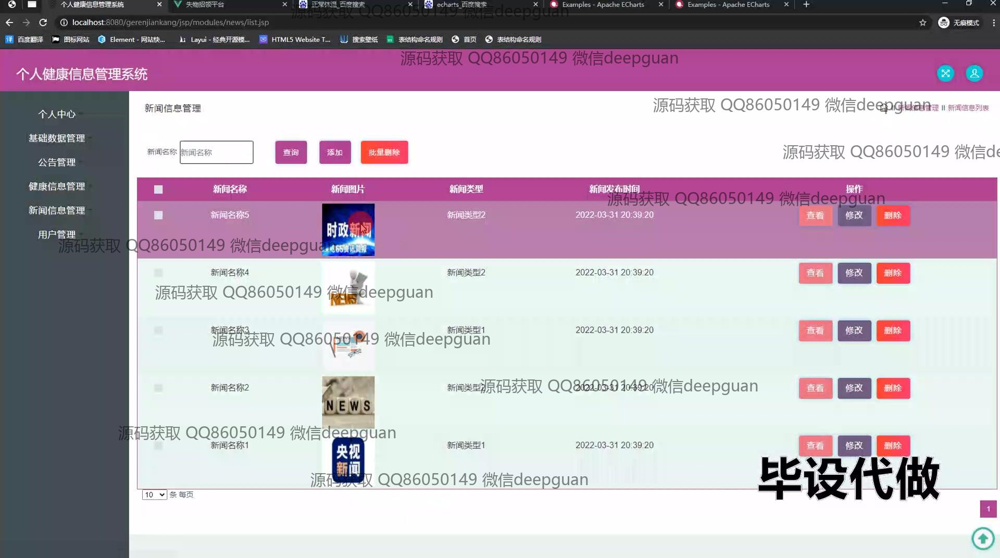
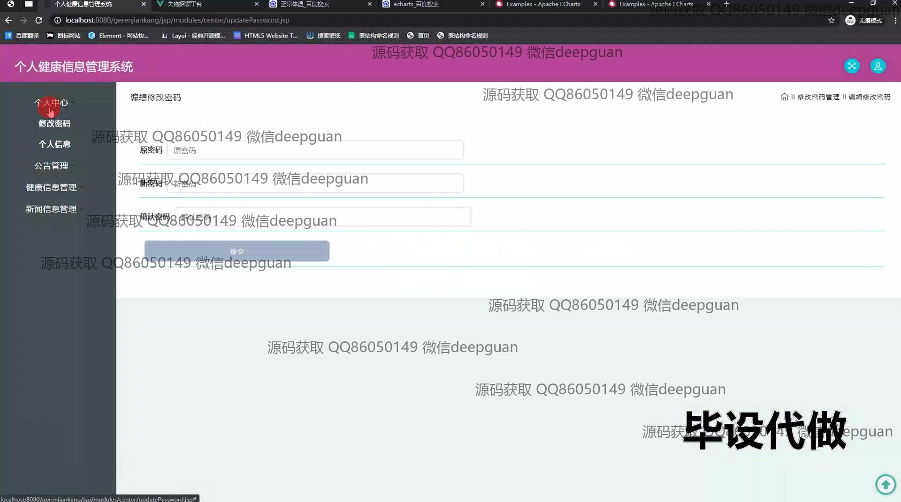
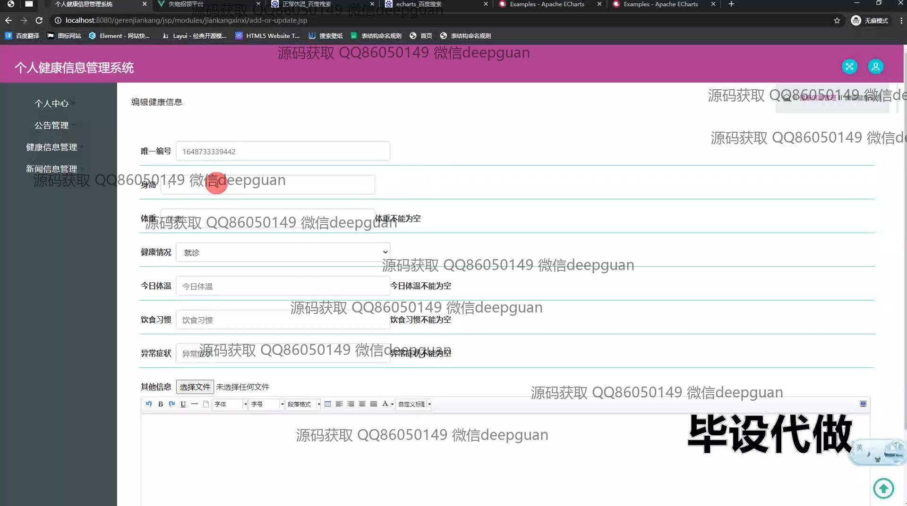
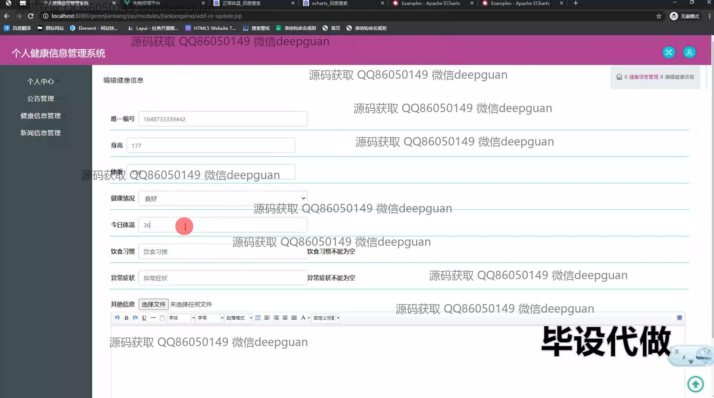
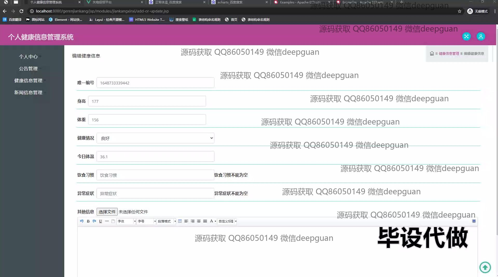
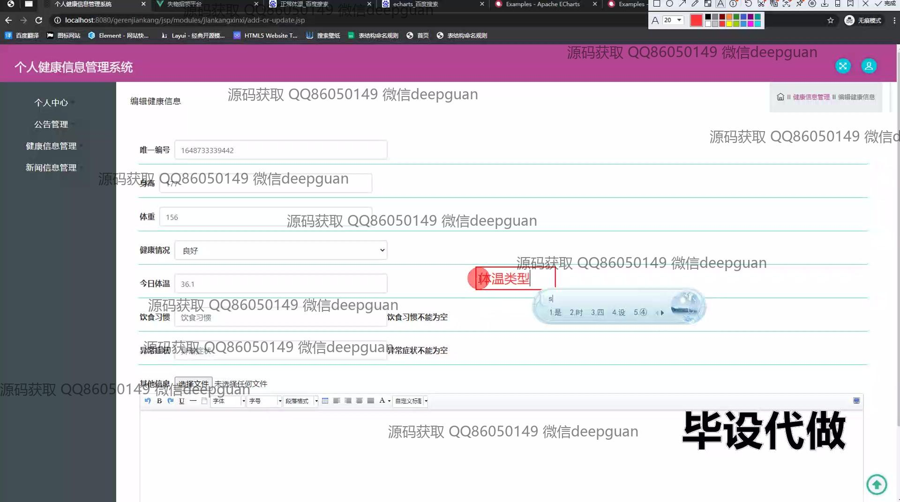
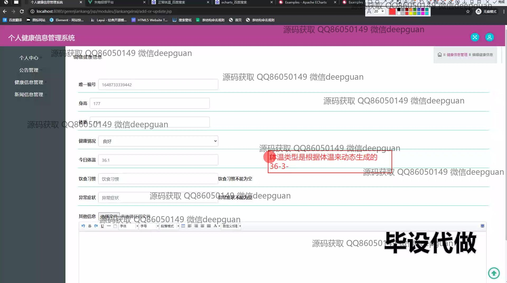
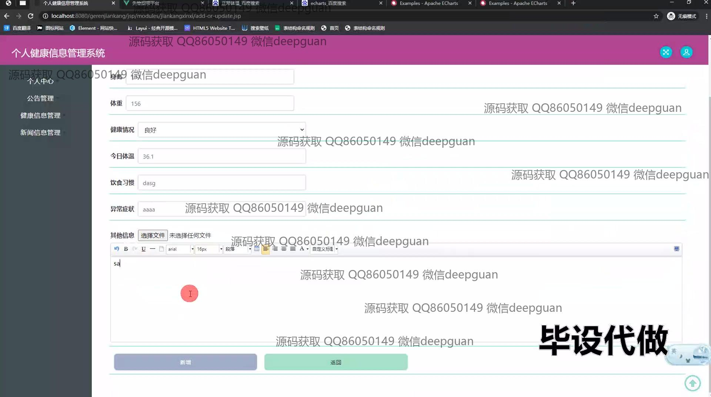
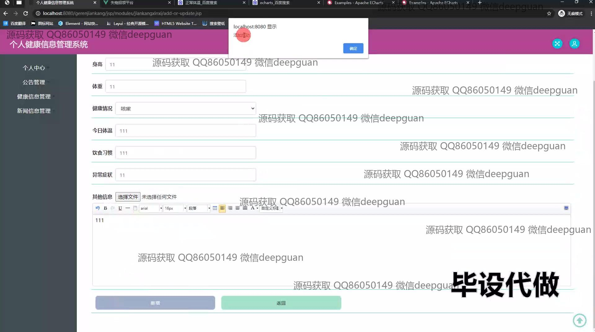
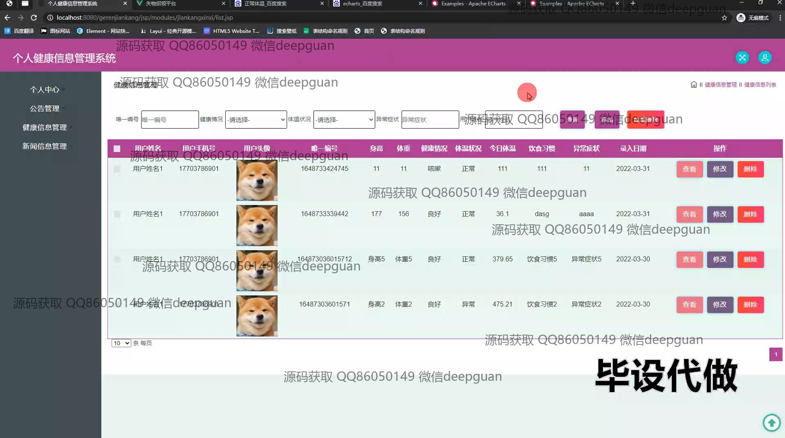
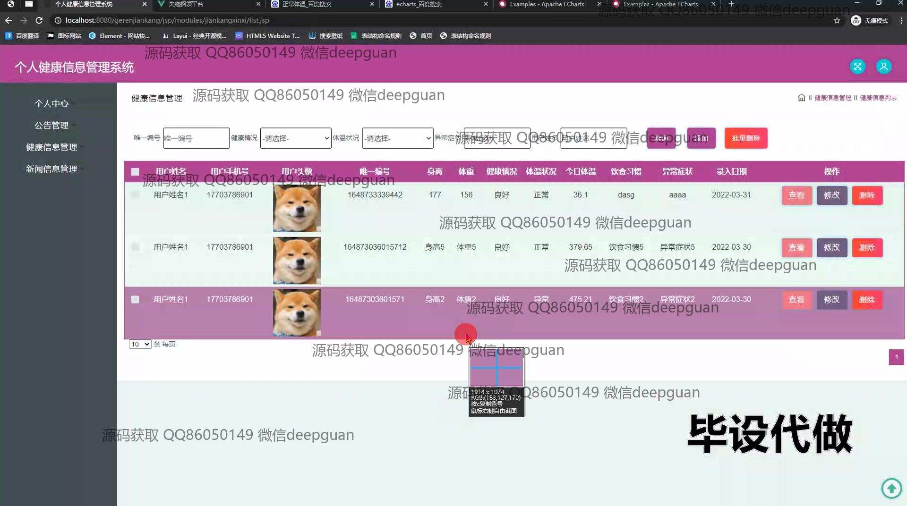
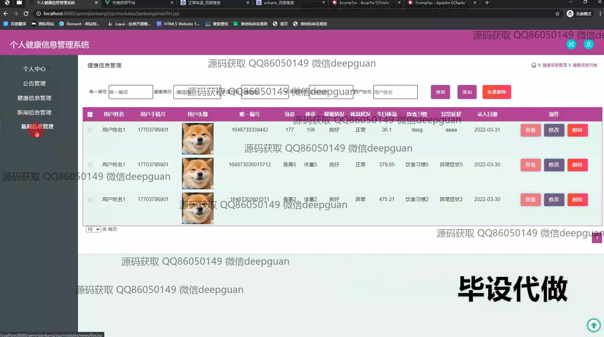

本代码来源于网络,仅供学习参考使用!

